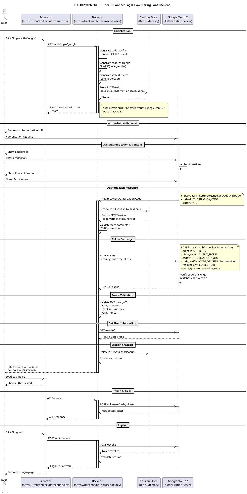

# OAuth2 with PKCE + OpenID Connect — Implementation Guide

## Project Context

- **Backend:** https://backend.brunorozendo.dev (Java Spring Boot)
- **Frontend:** https://frontend.brunorozendo.dev
- **OAuth2 Provider:** Google
- **Grant Type:** Authorization Code + PKCE
- **Protocol:** OpenID Connect (OIDC)

---

## Architecture Overview

The backend (Spring Boot) acts as a **Confidential Client** and is responsible for the **entire PKCE flow**:
- Generates `code_verifier` and `code_challenge`
- Stores them in server-side session (never sent to frontend)
- Receives the authorization code from Google
- Exchanges the code for tokens using the stored `code_verifier`
- Validates the ID token (JWT) and nonce
- Creates an authenticated server-side session

The frontend only:
- Requests the authorization URL from the backend
- Redirects the user to Google
- Loads the authenticated UI after the backend finalizes the session

---

## PKCE + OpenID Connect Flow

### Step 1 — Frontend calls Backend to initiate login

```bash
curl -X GET https://backend.brunorozendo.dev/auth/login/google \
  -c cookies.txt
```

**Response:**
```json
{
  "authorizationUrl": "https://accounts.google.com/o/oauth2/v2/auth?response_type=code&client_id=CLIENT_ID&redirect_uri=https://backend.brunorozendo.dev/auth/callback&scope=openid%20email%20profile&state=STATE&nonce=NONCE&code_challenge=CODE_CHALLENGE&code_challenge_method=S256",
  "state": "abc123..."
}
```

> The backend generates `code_verifier`, `code_challenge`, `state`, and `nonce` and stores them in the server-side session.

---

### Step 2 — User is redirected to Google Authorization URL

```
https://accounts.google.com/o/oauth2/v2/auth
  ?response_type=code
  &client_id=CLIENT_ID
  &redirect_uri=https://backend.brunorozendo.dev/auth/callback
  &scope=openid email profile
  &state=STATE
  &nonce=NONCE
  &code_challenge=CODE_CHALLENGE
  &code_challenge_method=S256
```

---

### Step 3 — Google redirects back to Backend callback

```
https://backend.brunorozendo.dev/auth/callback?code=AUTHORIZATION_CODE&state=STATE
```

The backend:
1. Retrieves the `PKCESession` from server-side session store
2. Validates the `state` (CSRF protection)
3. Uses the stored `code_verifier` to exchange the code for tokens

---

### Step 4 — Backend exchanges authorization code for tokens

```bash
curl -X POST https://oauth2.googleapis.com/token \
  -H "Content-Type: application/x-www-form-urlencoded" \
  -d "client_id=CLIENT_ID" \
  -d "client_secret=CLIENT_SECRET" \
  -d "code=AUTHORIZATION_CODE" \
  -d "code_verifier=CODE_VERIFIER" \
  -d "redirect_uri=https://backend.brunorozendo.dev/auth/callback" \
  -d "grant_type=authorization_code"
```

**Response:**
```json
{
  "access_token": "...",
  "id_token": "...",
  "refresh_token": "...",
  "expires_in": 3599,
  "token_type": "Bearer",
  "scope": "openid email profile"
}
```

---

### Step 5 — Backend validates the ID Token (JWT)

Checks performed:
- Signature using Google's public keys (`https://www.googleapis.com/oauth2/v3/certs`)
- `iss` = `https://accounts.google.com`
- `aud` = your `CLIENT_ID`
- `exp` is not expired
- `nonce` matches the one stored in session

```bash
# Fetch Google's public keys
curl https://www.googleapis.com/oauth2/v3/certs

# (Testing only) Inspect ID token
curl "https://oauth2.googleapis.com/tokeninfo?id_token=ID_TOKEN"
```

---

### Step 6 — Backend fetches user info

```bash
curl -X GET https://www.googleapis.com/oauth2/v3/userinfo \
  -H "Authorization: Bearer ACCESS_TOKEN"
```

**Response:**
```json
{
  "sub": "google-user-id",
  "email": "user@example.com",
  "name": "User Name",
  "picture": "https://...",
  "email_verified": true
}
```

---

### Step 7 — Get current authenticated user (Frontend calls Backend)

```bash
curl -X GET https://backend.brunorozendo.dev/auth/user \
  -b cookies.txt
```

**Response:**
```json
{
  "sub": "google-user-id",
  "email": "user@example.com",
  "name": "User Name"
}
```

---

### Step 8 — Refresh Access Token

```bash
curl -X POST https://oauth2.googleapis.com/token \
  -H "Content-Type: application/x-www-form-urlencoded" \
  -d "client_id=CLIENT_ID" \
  -d "client_secret=CLIENT_SECRET" \
  -d "refresh_token=REFRESH_TOKEN" \
  -d "grant_type=refresh_token"
```

---

### Step 9 — Logout

```bash
# Revoke tokens at Google
curl -X POST https://oauth2.googleapis.com/revoke \
  -H "Content-Type: application/x-www-form-urlencoded" \
  -d "token=REFRESH_TOKEN"

# Invalidate backend session
curl -X POST https://backend.brunorozendo.dev/auth/logout \
  -b cookies.txt
```

---

## Sequence Diagram (PlantUML)



---

## Spring Boot Implementation

### Dependencies (pom.xml)

```xml
<dependency>
    <groupId>org.springframework.boot</groupId>
    <artifactId>spring-boot-starter-web</artifactId>
</dependency>
<dependency>
    <groupId>org.springframework.boot</groupId>
    <artifactId>spring-boot-starter-oauth2-client</artifactId>
</dependency>
<dependency>
    <groupId>org.springframework.session</groupId>
    <artifactId>spring-session-core</artifactId>
</dependency>
```

### application.yml

```yaml
spring:
  security:
    oauth2:
      client:
        registration:
          google:
            client-id: ${GOOGLE_CLIENT_ID}
            client-secret: ${GOOGLE_CLIENT_SECRET}
            scope: openid,email,profile
            redirect-uri: https://backend.brunorozendo.dev/auth/callback
            authorization-grant-type: authorization_code
        provider:
          google:
            authorization-uri: https://accounts.google.com/o/oauth2/v2/auth
            token-uri: https://oauth2.googleapis.com/token
            user-info-uri: https://www.googleapis.com/oauth2/v3/userinfo
            jwk-set-uri: https://www.googleapis.com/oauth2/v3/certs
```

### PKCEUtil.java

```java
package com.brunorozendo.auth.util;

import java.nio.charset.StandardCharsets;
import java.security.MessageDigest;
import java.security.SecureRandom;
import java.util.Base64;

public class PKCEUtil {

    private static final SecureRandom secureRandom = new SecureRandom();
    private static final Base64.Encoder base64Encoder = Base64.getUrlEncoder().withoutPadding();

    public static String generateCodeVerifier() {
        byte[] codeVerifier = new byte[32];
        secureRandom.nextBytes(codeVerifier);
        return base64Encoder.encodeToString(codeVerifier);
    }

    public static String generateCodeChallenge(String codeVerifier) {
        try {
            byte[] bytes = codeVerifier.getBytes(StandardCharsets.US_ASCII);
            MessageDigest messageDigest = MessageDigest.getInstance("SHA-256");
            byte[] digest = messageDigest.digest(bytes);
            return base64Encoder.encodeToString(digest);
        } catch (Exception e) {
            throw new RuntimeException("Failed to generate code challenge", e);
        }
    }
}
```

### PKCESession.java

```java
package com.brunorozendo.auth.model;

import java.time.Instant;

public class PKCESession {
    private String codeVerifier;
    private String state;
    private String nonce;
    private Instant createdAt;

    public PKCESession(String codeVerifier, String state, String nonce) {
        this.codeVerifier = codeVerifier;
        this.state = state;
        this.nonce = nonce;
        this.createdAt = Instant.now();
    }

    public String getCodeVerifier() { return codeVerifier; }
    public String getState() { return state; }
    public String getNonce() { return nonce; }
    public Instant getCreatedAt() { return createdAt; }

    public boolean isExpired() {
        return Instant.now().isAfter(createdAt.plusSeconds(600)); // 10 min TTL
    }
}
```

### PKCESessionStore.java

```java
package com.brunorozendo.auth.service;

import com.brunorozendo.auth.model.PKCESession;
import org.springframework.stereotype.Service;
import java.util.Map;
import java.util.concurrent.ConcurrentHashMap;

@Service
public class PKCESessionStore {

    // In production, replace with Redis or distributed cache
    private final Map<String, PKCESession> sessions = new ConcurrentHashMap<>();

    public void save(String sessionId, PKCESession pkceSession) {
        sessions.put(sessionId, pkceSession);
    }

    public PKCESession get(String sessionId) {
        PKCESession session = sessions.get(sessionId);
        if (session != null && session.isExpired()) {
            sessions.remove(sessionId);
            return null;
        }
        return session;
    }

    public void remove(String sessionId) {
        sessions.remove(sessionId);
    }
}
```

### OAuth2Controller.java

```java
package com.brunorozendo.auth.controller;

import com.brunorozendo.auth.model.PKCESession;
import com.brunorozendo.auth.service.PKCESessionStore;
import com.brunorozendo.auth.util.PKCEUtil;
import jakarta.servlet.http.HttpSession;
import org.springframework.beans.factory.annotation.Value;
import org.springframework.http.*;
import org.springframework.util.LinkedMultiValueMap;
import org.springframework.util.MultiValueMap;
import org.springframework.web.bind.annotation.*;
import org.springframework.web.client.RestTemplate;
import org.springframework.web.util.UriComponentsBuilder;
import java.security.SecureRandom;
import java.util.Map;

@RestController
@RequestMapping("/auth")
public class OAuth2Controller {

    @Value("${spring.security.oauth2.client.registration.google.client-id}")
    private String clientId;

    @Value("${spring.security.oauth2.client.registration.google.client-secret}")
    private String clientSecret;

    @Value("${spring.security.oauth2.client.registration.google.redirect-uri}")
    private String redirectUri;

    private final PKCESessionStore pkceSessionStore;
    private final RestTemplate restTemplate;
    private final SecureRandom secureRandom = new SecureRandom();

    public OAuth2Controller(PKCESessionStore pkceSessionStore) {
        this.pkceSessionStore = pkceSessionStore;
        this.restTemplate = new RestTemplate();
    }

    @GetMapping("/login/google")
    public ResponseEntity<Map<String, String>> initiateLogin(HttpSession session) {
        String codeVerifier = PKCEUtil.generateCodeVerifier();
        String codeChallenge = PKCEUtil.generateCodeChallenge(codeVerifier);
        String state = generateRandomString();
        String nonce = generateRandomString();

        pkceSessionStore.save(session.getId(), new PKCESession(codeVerifier, state, nonce));

        String authorizationUrl = UriComponentsBuilder
            .fromHttpUrl("https://accounts.google.com/o/oauth2/v2/auth")
            .queryParam("response_type", "code")
            .queryParam("client_id", clientId)
            .queryParam("redirect_uri", redirectUri)
            .queryParam("scope", "openid email profile")
            .queryParam("state", state)
            .queryParam("nonce", nonce)
            .queryParam("code_challenge", codeChallenge)
            .queryParam("code_challenge_method", "S256")
            .build().toUriString();

        return ResponseEntity.ok(Map.of("authorizationUrl", authorizationUrl, "state", state));
    }

    @GetMapping("/callback")
    public ResponseEntity<?> handleCallback(@RequestParam String code,
                                            @RequestParam String state,
                                            HttpSession session) {
        PKCESession pkceSession = pkceSessionStore.get(session.getId());

        if (pkceSession == null)
            return ResponseEntity.status(HttpStatus.BAD_REQUEST).body(Map.of("error", "Session expired"));

        if (!state.equals(pkceSession.getState()))
            return ResponseEntity.status(HttpStatus.BAD_REQUEST).body(Map.of("error", "Invalid state"));

        try {
            Map<String, Object> tokens = exchangeCodeForTokens(code, pkceSession.getCodeVerifier());
            String idToken = (String) tokens.get("id_token");

            if (!validateIdToken(idToken, pkceSession.getNonce()))
                return ResponseEntity.status(HttpStatus.UNAUTHORIZED).body(Map.of("error", "Invalid ID token"));

            String accessToken = (String) tokens.get("access_token");
            Map<String, Object> userInfo = getUserInfo(accessToken);

            pkceSessionStore.remove(session.getId());
            session.setAttribute("user", userInfo);
            session.setAttribute("accessToken", accessToken);
            session.setAttribute("refreshToken", tokens.get("refresh_token"));

            return ResponseEntity.status(HttpStatus.FOUND)
                .header(HttpHeaders.LOCATION, "https://frontend.brunorozendo.dev/dashboard")
                .build();
        } catch (Exception e) {
            return ResponseEntity.status(HttpStatus.INTERNAL_SERVER_ERROR)
                .body(Map.of("error", "Token exchange failed: " + e.getMessage()));
        }
    }

    @GetMapping("/user")
    public ResponseEntity<?> getCurrentUser(HttpSession session) {
        Map<String, Object> user = (Map<String, Object>) session.getAttribute("user");
        if (user == null)
            return ResponseEntity.status(HttpStatus.UNAUTHORIZED).body(Map.of("error", "Not authenticated"));
        return ResponseEntity.ok(user);
    }

    @PostMapping("/logout")
    public ResponseEntity<?> logout(HttpSession session) {
        String refreshToken = (String) session.getAttribute("refreshToken");
        if (refreshToken != null) revokeToken(refreshToken);
        session.invalidate();
        return ResponseEntity.ok(Map.of("message", "Logged out successfully"));
    }

    private Map<String, Object> exchangeCodeForTokens(String code, String codeVerifier) {
        HttpHeaders headers = new HttpHeaders();
        headers.setContentType(MediaType.APPLICATION_FORM_URLENCODED);
        MultiValueMap<String, String> body = new LinkedMultiValueMap<>();
        body.add("client_id", clientId);
        body.add("client_secret", clientSecret);
        body.add("code", code);
        body.add("code_verifier", codeVerifier);
        body.add("redirect_uri", redirectUri);
        body.add("grant_type", "authorization_code");
        return restTemplate.exchange("https://oauth2.googleapis.com/token",
            HttpMethod.POST, new HttpEntity<>(body, headers), Map.class).getBody();
    }

    private Map<String, Object> getUserInfo(String accessToken) {
        HttpHeaders headers = new HttpHeaders();
        headers.setBearerAuth(accessToken);
        return restTemplate.exchange("https://www.googleapis.com/oauth2/v3/userinfo",
            HttpMethod.GET, new HttpEntity<>(headers), Map.class).getBody();
    }

    private boolean validateIdToken(String idToken, String expectedNonce) {
        // Use a proper JWT library in production:
        // - com.auth0:java-jwt
        // - io.jsonwebtoken:jjwt
        // - org.springframework.security:spring-security-oauth2-jose
        // WARN: This is a placeholder! You MUST implement proper JWT validation before production.
        // Verify: signature, iss, aud, exp, nonce
        return true; // placeholder
    }

    private void revokeToken(String token) {
        try {
            MultiValueMap<String, String> body = new LinkedMultiValueMap<>();
            body.add("token", token);
            HttpHeaders headers = new HttpHeaders();
            headers.setContentType(MediaType.APPLICATION_FORM_URLENCODED);
            restTemplate.postForEntity("https://oauth2.googleapis.com/revoke",
                new HttpEntity<>(body, headers), String.class);
        } catch (Exception ignored) {}
    }

    private String generateRandomString() {
        byte[] bytes = new byte[16];
        secureRandom.nextBytes(bytes);
        return java.util.Base64.getUrlEncoder().withoutPadding().encodeToString(bytes);
    }
}
```

---

## Security Notes

| Concern | Mitigation |
|---|---|
| CSRF attack | `state` parameter validated on callback |
| Token replay attack | `nonce` validated in ID token |
| Code interception | PKCE `code_verifier` never leaves the backend |
| Session hijacking | HttpOnly + Secure session cookie |
| Expired tokens | `refresh_token` used to get new `access_token` |
| Logout | Tokens revoked at Google + server session destroyed |

---

## Google Cloud Console Setup Checklist

- [ ] Create a project in Google Cloud Console
- [ ] Enable the **Google Identity API**
- [ ] Create OAuth 2.0 credentials (Web Application)
- [ ] Add authorized redirect URI: `https://backend.brunorozendo.dev/auth/callback`
- [ ] Add authorized JavaScript origin: `https://frontend.brunorozendo.dev`
- [ ] Copy `CLIENT_ID` and `CLIENT_SECRET` to environment variables

---

## Environment Variables

```env
GOOGLE_CLIENT_ID=your-client-id.apps.googleusercontent.com
GOOGLE_CLIENT_SECRET=your-client-secret
```

---

## Next Steps / TODOs

- [ ] Replace in-memory `PKCESessionStore` with **Redis** for production/multi-instance setups
- [ ] Implement proper **JWT validation** using `spring-security-oauth2-jose`
- [ ] Add **HTTPS enforcement** and secure cookie configuration
- [ ] Add **rate limiting** on `/auth/login/google` endpoint
- [ ] Implement **logout redirect** to frontend login page
- [ ] Add **error page** handling for failed OAuth2 flows
- [ ] Consider adding **Spring Security** filter chain for session-based auth